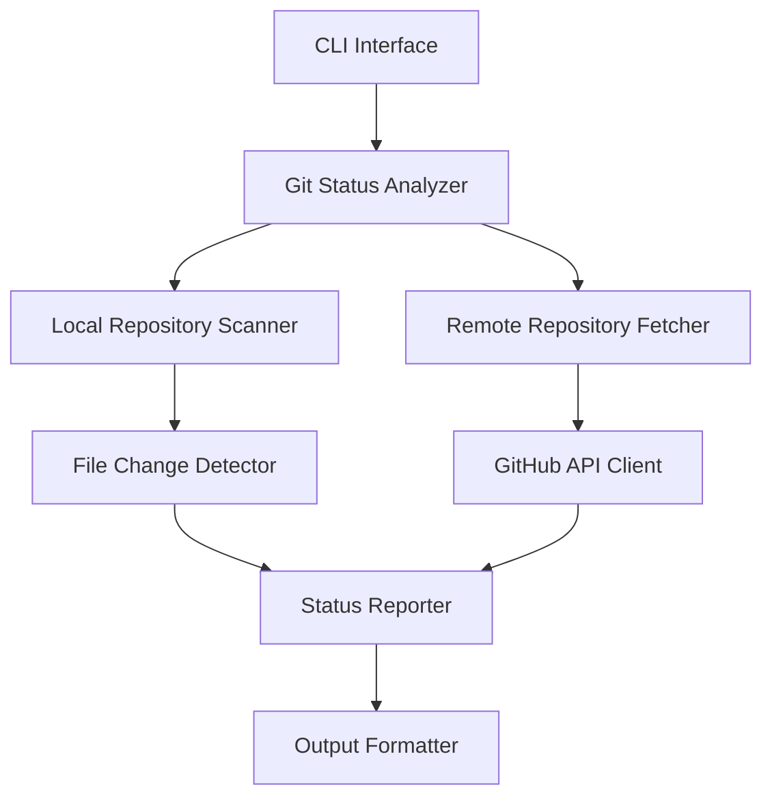
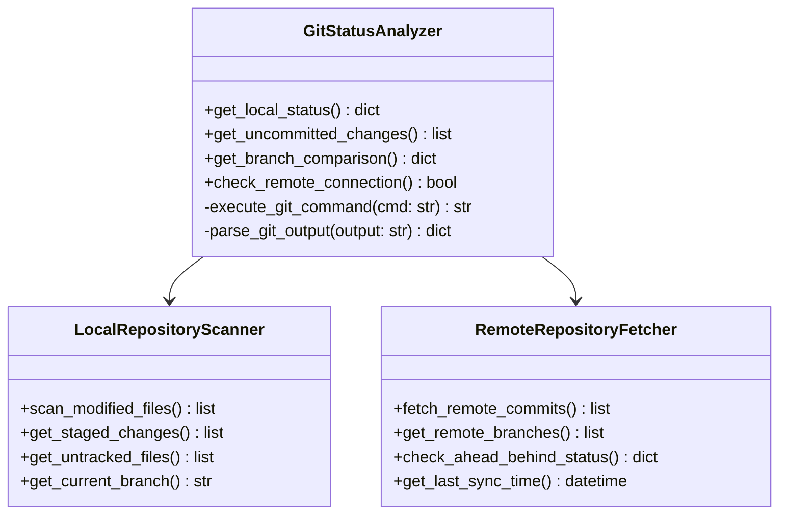
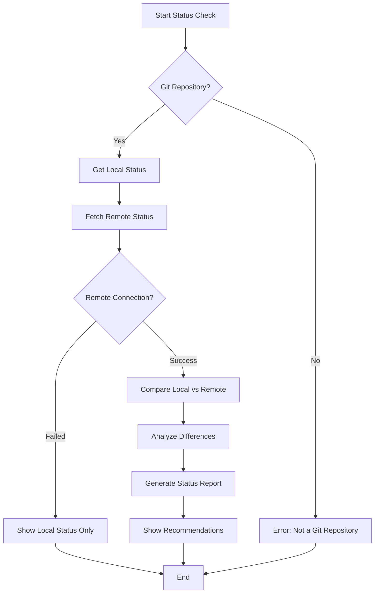
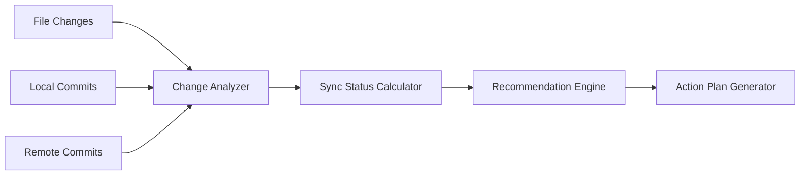

# GitHub Code Status Checker Feature Design

## Overview

This feature implements a GitHub repository status checking functionality that compares the local codebase with the remote GitHub repository. It provides users with insights about uncommitted changes, pending commits, and synchronization status between local and remote repositories.

## Architecture

### System Components



### Core Modules

1. **Git Status Analyzer** (`git_analyzer.py`)
   - Executes git commands to gather repository status
   - Analyzes local vs remote branch differences
   - Tracks uncommitted changes

2. **GitHub API Client** (`github_client.py`)
   - Interfaces with GitHub API to fetch remote repository information
   - Retrieves commit history and branch status
   - Handles authentication and rate limiting

3. **Status Reporter** (`status_reporter.py`)
   - Compiles comprehensive status reports
   - Formats comparison results
   - Generates actionable recommendations

## Component Architecture

### Git Status Analyzer



### GitHub API Integration

| Endpoint | Purpose | Data Retrieved |
|----------|---------|----------------|
| `/repos/{owner}/{repo}/commits` | Latest commits | Commit SHA, message, timestamp |
| `/repos/{owner}/{repo}/branches` | Branch information | Branch names, protection status |
| `/repos/{owner}/{repo}/compare/{base}...{head}` | Branch comparison | Ahead/behind commit count |
| `/repos/{owner}/{repo}/contents/{path}` | File contents | Latest file versions for comparison |

### Status Comparison Logic



## API Endpoints Reference

### New Endpoint: `/status/github`

**Method**: GET
**Description**: Returns comprehensive GitHub repository status

**Response Schema**:
``json
{
  "repository": {
    "name": "tbuddy_translation_TG-tool",
    "remote_url": "https://github.com/user/repo.git",
    "current_branch": "main"
  },
  "local_status": {
    "uncommitted_changes": 3,
    "staged_files": 1,
    "untracked_files": 2,
    "modified_files": ["app.py", "requirements.txt"],
    "last_commit": {
      "sha": "abc123",
      "message": "Update deployment configuration",
      "timestamp": "2024-01-15T10:30:00Z"
    }
  },
  "remote_status": {
    "latest_commit": {
      "sha": "def456",
      "message": "Fix authentication bug",
      "timestamp": "2024-01-15T09:15:00Z"
    },
    "ahead_count": 2,
    "behind_count": 1
  },
  "sync_status": {
    "is_synchronized": false,
    "needs_pull": true,
    "needs_push": true,
    "recommendations": [
      "Pull latest changes from remote",
      "Commit local changes",
      "Push to remote repository"
    ]
  }
}
```

### CLI Command Interface

**Command**: `python git_status_checker.py`

**Options**:
- `--detailed`: Show detailed file-by-file comparison
- `--remote-only`: Check only remote status without local comparison
- `--format=json|table|summary`: Output format
- `--branch=<name>`: Check specific branch instead of current

## Data Models & State Management

### Repository Status Model

```python
@dataclass
class RepositoryStatus:
    name: str
    remote_url: str
    current_branch: str
    local_commit_sha: str
    remote_commit_sha: str
    uncommitted_changes: int
    ahead_count: int
    behind_count: int
    is_synchronized: bool
    last_sync_time: Optional[datetime]
```

### Change Detection Model

```python
@dataclass
class FileChange:
    file_path: str
    change_type: str  # 'modified', 'added', 'deleted', 'renamed'
    lines_added: int
    lines_removed: int
    last_modified: datetime
```

## Business Logic Layer

### Status Analysis Engine



### Synchronization Rules

1. **Up-to-date**: Local and remote HEAD match, no uncommitted changes
2. **Ahead**: Local has commits not in remote
3. **Behind**: Remote has commits not in local
4. **Diverged**: Both local and remote have unique commits
5. **Dirty**: Uncommitted local changes exist

### Recommendation Logic

| Status | Recommended Actions |
|--------|-------------------|
| Behind | `git pull origin <branch>` |
| Ahead | `git push origin <branch>` |
| Diverged | `git pull --rebase` then `git push` |
| Dirty + Behind | Commit changes, then pull |
| Dirty + Ahead | Commit changes, then push |

## Testing Strategy

### Unit Testing

```python
# Test file: test_git_status_checker.py
class TestGitStatusAnalyzer(unittest.TestCase):
    def test_get_uncommitted_changes(self):
        # Test detection of modified files
        pass
    
    def test_branch_comparison(self):
        # Test ahead/behind calculation
        pass
    
    def test_remote_connection_failure(self):
        # Test handling of network issues
        pass
```

### Integration Testing

1. **Mock Git Repository**: Create test repository with known state
2. **GitHub API Mocking**: Mock API responses for consistent testing
3. **Network Failure Simulation**: Test offline scenarios
4. **Different Repository States**: Test various sync scenarios

### Test Scenarios

- ✅ Clean repository (no changes)
- ✅ Local changes only
- ✅ Remote changes only  
- ✅ Conflicting changes
- ✅ Network connectivity issues
- ✅ Invalid repository paths
- ✅ Permission errors

## Implementation Phases

### Phase 1: Basic Git Status
- Implement local repository scanning
- Basic git command execution
- Simple status reporting

### Phase 2: Remote Integration
- GitHub API client implementation
- Remote repository comparison
- Network error handling

### Phase 3: Advanced Features
- Detailed file comparison
- Visual diff display
- Automated sync recommendations

### Phase 4: CLI Enhancement
- Interactive mode
- Configuration file support
- Integration with existing deployment scripts
