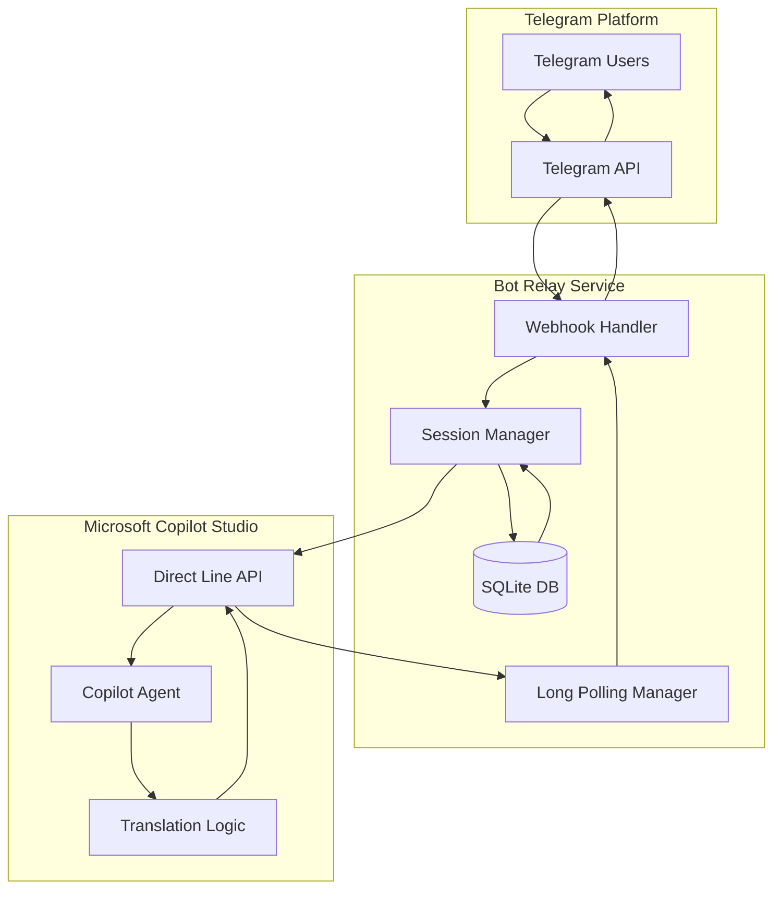
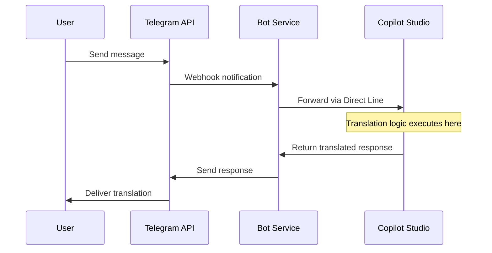

# Bot Translation Service Cleanup Analysis

## Overview

This document analyzes the current Telegram translation bot architecture to verify compliance with the requirement that **no direct translation service calls should exist in the bot code**. All translation logic must be executed within the Copilot Studio agent.

## Current Architecture Analysis

### Backend Service Architecture

The application follows a **relay service pattern** where the Telegram bot acts as a message broker between Telegram users and Microsoft Copilot Studio agent:



### Translation Logic Location

**✅ COMPLIANT**: The bot contains **NO direct translation service integrations**. Analysis confirms:

1. **No Translation Service Dependencies**
   - No Google Translate, Azure Translator, AWS Translate, DeepL, or other translation API imports
   - No translation service API keys in configuration
   - No external translation library dependencies in `requirements.txt`

2. **Pure Message Relay Architecture**
   - Bot only forwards messages between Telegram and Copilot Studio
   - All translation processing occurs within Copilot Studio agent
   - Bot handles session management and message routing only

## API Endpoints Reference

### Core Communication Endpoints

| Endpoint | Method | Purpose | Translation Logic |
|----------|--------|---------|-------------------|
| `/webhook` | POST | Telegram message handler | None - forwards to Copilot |
| `/health` | GET | Service health check | None |
| `/dump-settings` | GET | Debug settings display | None |
| `/status/github` | GET | Repository status | None |

### Message Flow Architecture



## Business Logic Layer

### Message Processing Pipeline

The bot implements a **stateless relay pattern** with the following processing stages:

1. **Message Reception**
   - Receives Telegram webhook
   - Extracts chat context and user message
   - Validates message format

2. **Session Management**
   - Maintains conversation state with Copilot Studio
   - Handles Direct Line token lifecycle
   - Manages conversation watermarks

3. **Message Forwarding**
   - Sends user message to Copilot Studio via Direct Line API
   - No modification or translation of content
   - Preserves original message context

4. **Response Handling**
   - Receives translated response from Copilot Studio
   - Forwards response to Telegram user
   - No post-processing of translation content

5. **Language Setup Persistence**
   - Parses language setup confirmations from Copilot
   - Stores user language preferences in local database
   - Used for session restoration only

### Core Functions Analysis

| Function | Purpose | Translation Logic |
|----------|---------|-------------------|
| `parse_and_persist_setup()` | Extract language preferences from Copilot responses | None - parsing only |
| `send_message_to_copilot()` | Forward user message to Copilot | None - direct forwarding |
| `get_copilot_response()` | Retrieve bot responses | None - direct relay |
| `start_direct_line_conversation()` | Initialize Copilot session | None - session management |
| `long_poll_for_activity()` | Handle delayed responses | None - polling mechanism |

## Data Models & Persistence

### Database Schema

The bot uses a minimal SQLite database for session persistence:

```sql
CREATE TABLE IF NOT EXISTS ChatSettings (
    chat_id TEXT PRIMARY KEY,
    conversation_id TEXT,
    language_names TEXT,
    last_updated TEXT
);
```

**No translation-related data storage** - only user preferences and session metadata.

### In-Memory State Management

| Component | Purpose | Translation Logic |
|-----------|---------|-------------------|
| `conversations` | Active Copilot sessions | None |
| `active_pollers` | Long polling tasks | None |
| `recent_activity_ids` | Duplicate prevention | None |
| `last_user_message` | Session context | None |

## External Integrations

### Microsoft Copilot Studio Integration

**Single External Service**: The bot integrates exclusively with Microsoft Copilot Studio via Direct Line API:

- **Authentication**: Bearer token authentication
- **Message Format**: Standard Direct Line message schema
- **Session Management**: Conversation ID and watermark tracking
- **Error Handling**: Token refresh and retry logic

### No Translation Service Integrations

**✅ VERIFIED**: Comprehensive code analysis confirms zero integration with:
- Google Cloud Translation API
- Azure Translator Text API
- AWS Translate
- DeepL API
- Yandex Translate
- OpenAI Translation
- Any other external translation services

## Testing Strategy

### Validation Approach

The current codebase includes validation scripts that test:

1. **Message Parsing Logic** (`test_fixes.py`)
   - Language setup confirmation parsing
   - Database operations
   - Session state management

2. **Database Connectivity** (`validate_fixes.py`)
   - SQLite operations
   - Settings persistence
   - Data integrity

3. **Direct Line Integration** (`tools/test_directline.py`)
   - Copilot Studio connectivity
   - Token validation
   - Conversation initialization

### Compliance Testing

To verify continued compliance with the "no translation services" requirement:

```python
def test_no_translation_services():
    """Verify no direct translation service calls exist."""
    # Check imports
    assert 'google.cloud.translate' not in sys.modules
    assert 'azure.ai.translation' not in sys.modules
    
    # Check environment variables
    env_vars = os.environ.keys()
    translation_keys = [k for k in env_vars if any(
        service in k.upper() for service in 
        ['GOOGLE', 'AZURE', 'DEEPL', 'YANDEX', 'TRANSLATE']
    )]
    assert len(translation_keys) == 0, f"Found translation API keys: {translation_keys}"
    
    # Check function calls
    # All translation logic should be in Copilot Studio
    pass
```

## Architecture Compliance Summary

### ✅ Compliant Areas

1. **No Direct Translation APIs**: Zero integration with external translation services
2. **Pure Relay Architecture**: Bot only forwards messages between platforms
3. **Copilot-Centralized Logic**: All translation processing occurs in Copilot Studio
4. **Minimal Dependencies**: Only essential messaging and session management libraries
5. **Clean Separation**: Clear boundary between bot logic and translation logic

### 🔧 Recommended Monitoring

1. **Dependency Auditing**: Regular review of `requirements.txt` for translation service additions
2. **Code Reviews**: Enforce prohibition of direct translation API integrations
3. **Environment Variable Auditing**: Monitor for translation service API keys
4. **Import Analysis**: Automated scanning for translation service library imports

## Conclusion

**✅ VERIFICATION COMPLETE**: The current bot implementation fully complies with the requirement that no translation services should be called directly from the bot code. The architecture correctly implements a pure relay pattern where:

- The bot acts as a message broker between Telegram and Copilot Studio
- All translation logic is executed within the Copilot Studio agent
- No external translation service dependencies exist in the codebase
- The bot maintains session state and forwards messages without modification

The system is properly architected with clear separation of concerns and can continue operating safely without risk of direct translation service calls.