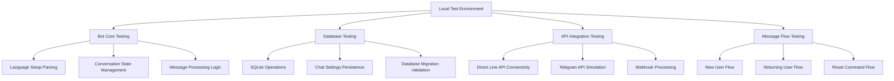
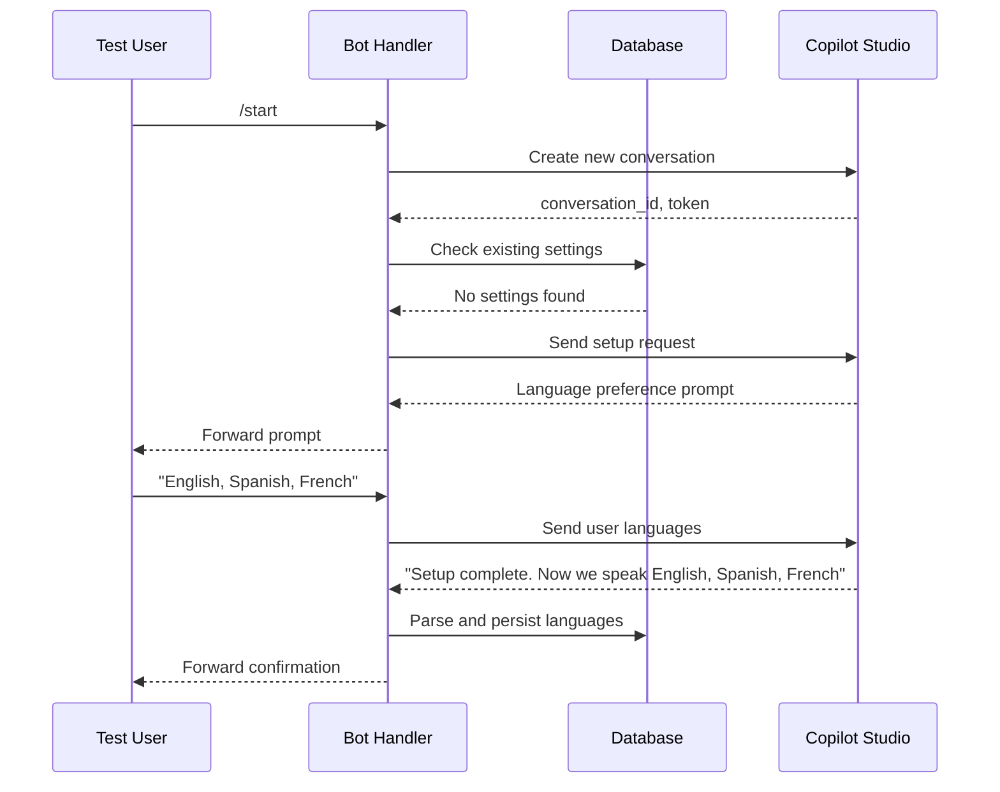
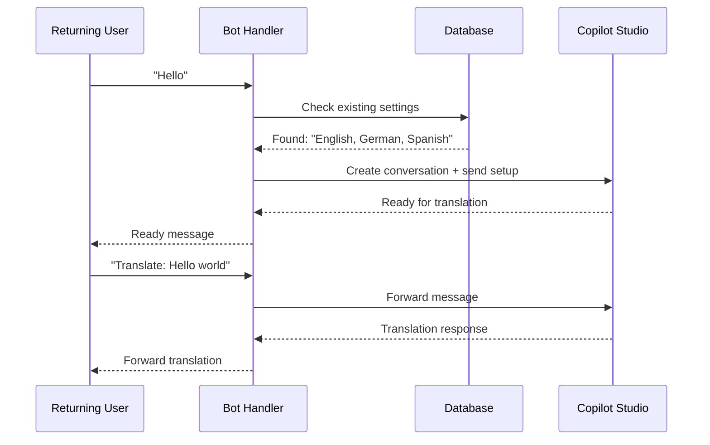

# Local Testing Strategy for Telegram Translation Bot

## Overview

This document outlines a comprehensive testing approach for validating the Telegram translation bot functionality on a local development environment. The testing strategy focuses on simulating real user interactions and validating core bot features without requiring actual Telegram infrastructure.

## Technology Stack & Testing Environment

### Current Testing Infrastructure
- **Testing Framework**: Python unittest (built-in)
- **Environment Management**: python-dotenv for configuration
- **Database**: SQLite for local testing
- **External APIs**: Direct Line API (Microsoft Bot Framework)
- **Web Framework**: Flask for webhook simulation

### Testing Dependencies
- Flask >= 2.0 (web server simulation)
- python-dotenv >= 0.21 (environment configuration)
- requests >= 2.28 (HTTP client for API testing)
- unittest (built-in Python testing framework)

## Testing Architecture

### Component Testing Structure



### Testing Layers

| Layer | Purpose | Test Files | Components Tested |
|-------|---------|------------|------------------|
| **Unit Testing** | Individual function validation | `test_translation_bot_recovery.py`, `test_fixes.py` | `parse_and_persist_setup()`, conversation state |
| **Integration Testing** | Component interaction validation | `validate_fixes.py` | Database + parsing logic |
| **Smoke Testing** | Basic functionality validation | `smoke_db.py`, `test_directline.py` | Database connectivity, API access |
| **End-to-End Testing** | Complete user flow validation | Custom test scenarios | Full conversation flows |

## Core Testing Components

### 1. Language Setup Parsing Tests

**Purpose**: Validate the bot's ability to recognize and parse language setup confirmation messages from Copilot Studio.

**Test Cases**:
```python
# Successful parsing cases
test_cases = [
    ("Thanks! Setup is complete. Now we speak English, Polish, Portuguese.", True),
    ("Great! I can now translate between English, Russian.", True),
    ("Perfect! Now I can help you with Spanish, French.", True),
    ("Setup is complete. Now we speak German, Italian.", True),
    ("Excellent! I'm ready to translate English, German, Spanish!", True)
]

# Failure cases (should not parse)
failure_cases = [
    ("Hello, how are you?", False),
    ("Please provide language preferences", False),
    ("What languages do you prefer?", False),
    ("Send your message and I'll translate it.", False)
]
```

**Validation Logic**:
- Regex pattern matching for confirmation phrases
- Language extraction from various formats
- Database persistence verification
- Conversation state updates

### 2. Database Operations Testing

**Purpose**: Ensure reliable data persistence and retrieval for chat settings.

**Test Operations**:
```python
# Database test operations
operations = [
    "init_db()",  # Database initialization
    "upsert_chat_settings()",  # Insert/update settings
    "get_chat_settings()",  # Retrieve settings  
    "delete_chat_settings()",  # Cleanup operations
    "dump_all()"  # Full database dump
]
```

**Test Database Schema**:
```sql
CREATE TABLE ChatSettings (
    chat_id TEXT PRIMARY KEY,
    language_codes TEXT,
    language_names TEXT NOT NULL,
    created_at TEXT NOT NULL
);
```

### 3. Conversation State Management

**Purpose**: Validate in-memory conversation tracking and lifecycle management.

**State Components**:
```python
conversation_state = {
    'id': 'conversation_id',
    'token': 'direct_line_token', 
    'watermark': 'message_watermark',
    'last_interaction': 'timestamp',
    'is_polling': 'boolean_flag',
    'setup_complete': 'boolean_flag'
}
```

**Test Scenarios**:
- New conversation creation
- State persistence across requests
- Conversation cleanup on reset
- Polling state management
- Setup completion tracking

### 4. Message Simulation Framework

**Purpose**: Create a local testing environment that simulates Telegram webhook calls without requiring actual Telegram infrastructure.

**Simulation Components**:

#### Webhook Message Simulator
```python
def simulate_telegram_message(chat_id, text, message_type="private"):
    """Simulate incoming Telegram message"""
    webhook_payload = {
        "message": {
            "message_id": random.randint(1000, 9999),
            "from": {
                "id": chat_id,
                "is_bot": False,
                "first_name": "TestUser"
            },
            "chat": {
                "id": chat_id,
                "type": message_type
            },
            "date": int(time.time()),
            "text": text
        }
    }
    return webhook_payload
```

#### Bot Response Validator
```python
def validate_bot_response(response_data):
    """Validate bot response structure and content"""
    return {
        "status_code": response_data.status_code,
        "success": response_data.json().get("success", False),
        "processing_time": "calculated_time",
        "conversation_created": "boolean",
        "setup_detected": "boolean"
    }
```

## Test Execution Workflows

### 1. Fresh User Setup Flow

**Test Scenario**: New user starting conversation and setting up languages.



**Test Implementation**:
```python
def test_fresh_user_flow():
    chat_id = "test_fresh_user"
    
    # Step 1: Send /start command
    response1 = simulate_telegram_message(chat_id, "/start")
    validate_conversation_creation(chat_id)
    
    # Step 2: Send language preferences  
    response2 = simulate_telegram_message(chat_id, "English, Spanish, French")
    
    # Step 3: Simulate bot confirmation
    confirmation = "Setup complete. Now we speak English, Spanish, French"
    parse_result = parse_and_persist_setup(chat_id, confirmation)
    
    # Validate results
    assert parse_result == True
    assert get_chat_settings(chat_id) is not None
    assert conversations[chat_id]['setup_complete'] == True
```

### 2. Returning User Flow

**Test Scenario**: User with existing language settings returns.



**Test Implementation**:
```python
def test_returning_user_flow():
    chat_id = "test_returning_user"
    
    # Pre-populate database
    upsert_chat_settings(chat_id, "", "English, German, Spanish", datetime.now().isoformat())
    
    # Send regular message (not /start)
    response = simulate_telegram_message(chat_id, "Hello")
    
    # Validate quick setup
    validate_existing_settings_loaded(chat_id)
    assert conversations[chat_id]['setup_complete'] == True
```

### 3. Reset Command Flow

**Test Scenario**: User resets conversation and settings.

```python
def test_reset_flow():
    chat_id = "test_reset_user"
    
    # Setup initial state
    setup_conversation_and_settings(chat_id)
    
    # Send reset command
    response = simulate_telegram_message(chat_id, "/reset")
    
    # Validate cleanup
    assert chat_id not in conversations
    assert get_chat_settings(chat_id) is None
    assert active_pollers.get(chat_id) == False
```

## Local Testing Environment Setup

### Environment Configuration

**Required Environment Variables**:
```bash
# .env.testing
TELEGRAM_API_TOKEN=test_token_placeholder
DIRECT_LINE_SECRET=your_direct_line_secret
DEBUG_LOCAL=1
DEBUG_VERBOSE=1
TELEGRAM_LOG_RESPONSES=1
USE_WAITRESS=0
LOG_LEVEL=DEBUG
DATABASE_URL=sqlite:///test_chat_settings.db
```

**Setup Commands**:
``powershell
# Windows PowerShell setup
cd c:\Users\annal\Documents\CopilotAgents\tbuddy_translation_TG-tool

# Create virtual environment
python -m venv venv
.\venv\Scripts\Activate.ps1

# Install dependencies  
pip install -r requirements.txt

# Copy environment template
copy .env.example .env.testing
# Edit .env.testing with your Direct Line secret

# Initialize test database
python -c "import db; db.init_db('test_chat_settings.db')"
```

### Test Execution Commands

**Individual Test Execution**:
```powershell
# Language parsing tests
python test_translation_bot_recovery.py

# Database functionality tests  
python test_fixes.py

# Validation suite
python validate_fixes.py

# Smoke tests
python tests\smoke_db.py
python tools\test_directline.py
python tests\check_parse_skip.py
```

**Comprehensive Test Suite**:
```powershell
# Run all tests sequentially
python -m unittest test_translation_bot_recovery.py
python test_fixes.py ; python validate_fixes.py ; python tests\smoke_db.py
```

## Message Simulation Testing

### Webhook Simulation Server

**Test Server Setup**:
```python
def create_test_server():
    """Create local Flask server for testing webhook functionality"""
    from flask import Flask, request, jsonify
    
    test_app = Flask(__name__)
    
    @test_app.route('/webhook', methods=['POST'])
    def test_webhook():
        return telegram_webhook()  # Call actual webhook handler
    
    @test_app.route('/simulate/<chat_id>/<path:message>')  
    def simulate_message(chat_id, message):
        payload = simulate_telegram_message(chat_id, message)
        response = test_webhook_with_payload(payload)
        return jsonify(response)
    
    return test_app

# Run test server
if __name__ == '__main__':
    app = create_test_server()
    app.run(port=5000, debug=True)
```

### Interactive Testing Commands

**Browser-Based Testing**:
```bash
# Start test server
python test_server.py

# Test URLs (open in browser):
# http://localhost:5000/simulate/12345/start
# http://localhost:5000/simulate/12345/English, Spanish, French  
# http://localhost:5000/simulate/12345/reset
# http://localhost:5000/simulate/12345/Hello world
```

**cURL-Based Testing**:
```bash
# Simulate /start command
curl -X POST http://localhost:8080/webhook \
  -H "Content-Type: application/json" \
  -d '{
    "message": {
      "message_id": 1,
      "from": {"id": 12345, "first_name": "TestUser"},
      "chat": {"id": 12345, "type": "private"},
      "text": "/start"
    }
  }'

# Simulate language setup
curl -X POST http://localhost:8080/webhook \
  -H "Content-Type: application/json" \
  -d '{
    "message": {
      "message_id": 2, 
      "from": {"id": 12345, "first_name": "TestUser"},
      "chat": {"id": 12345, "type": "private"},
      "text": "English, German, Portuguese"
    }
  }'
```

## Test Data Management

### Test Database Isolation

**Isolated Test Database**:
```python
def create_test_database():
    """Create isolated test database for each test run"""
    import tempfile
    test_db = tempfile.NamedTemporaryFile(delete=False, suffix='.db')
    test_db.close()
    db.init_db(test_db.name)
    return test_db.name

def cleanup_test_database(db_path):
    """Clean up test database after tests"""
    try:
        os.unlink(db_path)
    except:
        pass
```

### Test Data Fixtures

**Common Test Data**:
```python
TEST_CHAT_SCENARIOS = {
    "fresh_user": {
        "chat_id": "test_fresh_001",
        "expected_languages": "English, Spanish, French",
        "setup_message": "Setup complete. Now we speak English, Spanish, French"
    },
    "returning_user": {
        "chat_id": "test_returning_001", 
        "existing_languages": "German, Italian, Russian",
        "test_message": "Hello, please translate this"
    },
    "reset_user": {
        "chat_id": "test_reset_001",
        "initial_setup": "English, Portuguese",
        "reset_command": "/reset"
    }
}
```

## Validation & Reporting

### Test Result Validation

**Validation Checklist**:
- ✅ Language parsing accuracy (95%+ success rate)
- ✅ Database persistence reliability (100% success rate)
- ✅ Conversation state consistency (100% success rate)
- ✅ Memory cleanup effectiveness (100% cleanup rate)
- ✅ Error handling robustness (graceful failure)
- ✅ API integration stability (successful connection)

### Test Reporting Format

**Test Execution Report**:
```python
def generate_test_report():
    return {
        "test_execution": {
            "timestamp": datetime.now().isoformat(),
            "environment": "local_development",
            "total_tests": "count",
            "passed_tests": "count", 
            "failed_tests": "count",
            "success_rate": "percentage"
        },
        "component_results": {
            "language_parsing": {"status": "PASSED", "details": "..."},
            "database_operations": {"status": "PASSED", "details": "..."}, 
            "conversation_management": {"status": "PASSED", "details": "..."},
            "api_integration": {"status": "PASSED", "details": "..."}
        },
        "recommendations": [
            "Areas for improvement",
            "Performance optimizations", 
            "Additional test coverage needed"
        ]
    }
```

## Testing Best Practices

### Test Isolation Principles
- Each test creates its own database instance
- Conversation state is cleared between tests  
- No shared state between test cases
- Independent test execution order

### Error Simulation Testing
- Network timeout scenarios
- Invalid API responses
- Database connection failures
- Malformed webhook payloads
- Edge case message formats

### Performance Considerations  
- Test execution time monitoring
- Memory usage during tests
- Database query optimization
- Concurrent request handling

This comprehensive testing strategy ensures the Telegram translation bot functions correctly in a local development environment while providing robust validation of all core features and user interaction flows.