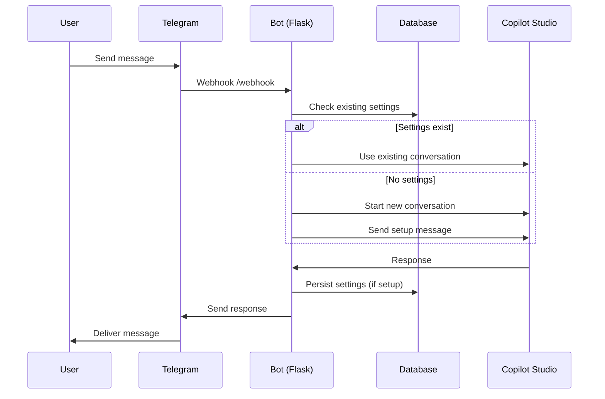
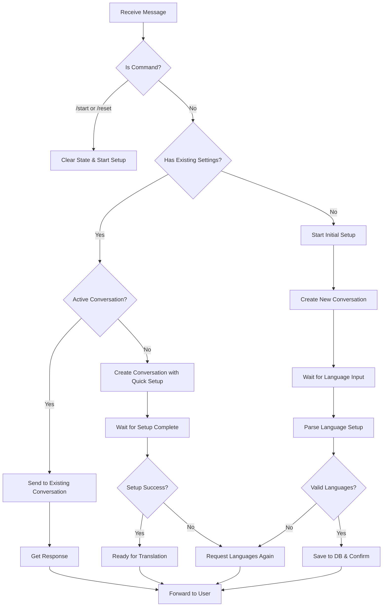

# Translation Bot Recovery Task

## Overview
Fix the T.Buddy translation bot that has become non-functional after recent modifications. The bot is currently stuck in a loop asking for language preferences and not performing translations.

## Repository Type Detection
**Backend Application** - Flask-based Telegram bot with Microsoft Copilot Studio integration

## Problem Analysis

Based on the logs and code analysis, several critical issues have been identified:

### 1. Conversation State Management Issues
- Bot creates new conversations for every message instead of reusing existing ones
- Existing conversation state gets lost between messages  
- Language setup is not properly persisted across conversation resets

### 2. Message Flow Problems
- The bot repeatedly asks "What's languages you prefer?" even after setup is complete
- Quick setup messages are being sent incorrectly to new conversations
- Bot doesn't recognize when setup is actually complete

### 3. Database Persistence Issues  
- Language settings are being overwritten incorrectly
- Settings show only "English" instead of "English, Polish, Portuguese"
- Database state doesn't match conversation state

## Architecture



## Core Issues to Fix

### Issue 1: Conversation Lifecycle Management
**Problem**: Bot creates new Direct Line conversations for each message instead of reusing existing ones.

**Root Cause**: Conversation state is cleared too aggressively or not properly maintained in memory.

**Solution**: 
- Preserve existing conversations unless explicitly reset
- Only create new conversations when necessary
- Implement proper conversation expiry handling

### Issue 2: Language Setup Recognition
**Problem**: Bot doesn't recognize successful language setup completion.

**Root Cause**: `parse_and_persist_setup()` function is not correctly identifying setup confirmation messages.

**Solution**:
- Fix pattern matching for setup confirmation messages
- Ensure proper language extraction from bot responses
- Verify database persistence logic

### Issue 3: Quick Setup Logic
**Problem**: When existing settings are found, the "quick setup" message sent to new conversations is confusing the bot.

**Root Cause**: The quick setup format doesn't match what Copilot Studio expects.

**Solution**:
- Review and fix the quick setup message format
- Ensure it properly initializes the conversation with existing languages
- Handle the setup confirmation correctly

## Technical Specifications

### Database Schema
```sql
CREATE TABLE ChatSettings (
    chat_id TEXT PRIMARY KEY,
    language_codes TEXT,     -- e.g., "en,pl,pt"
    language_names TEXT,     -- e.g., "English, Polish, Portuguese"  
    updated_at TEXT
);
```

### Conversation State Management
```python
conversations = {
    chat_id: {
        'id': conversation_id,
        'token': direct_line_token,
        'watermark': last_watermark,
        'last_interaction': timestamp,
        'is_polling': boolean,
        'setup_complete': boolean  # New field to track setup state
    }
}
```

### Message Processing Flow



## Implementation Plan

### Phase 1: Stabilize Core Functionality
1. **Fix conversation state management**
   - Ensure conversations persist between messages
   - Only reset on explicit commands (/reset, /start)
   - Handle token expiry gracefully

2. **Fix language setup parsing**
   - Verify `parse_and_persist_setup()` patterns
   - Ensure proper language extraction
   - Fix database persistence

3. **Simplify quick setup logic**
   - Remove or fix the problematic quick setup feature
   - Ensure clean language setup flow

### Phase 2: Add Incremental Improvements
1. **Add typing indicators** (only after core functionality works)
2. **Improve group chat support** (only after core functionality works)
3. **Add performance optimizations** (only after core functionality works)

## Testing Strategy

### Core Functionality Tests
1. **Basic Setup Flow**
   - `/start` → Language request → User provides languages → Setup confirmation → Translation ready

2. **Translation Flow**  
   - Send message after setup → Get translation response

3. **Persistence Test**
   - Setup languages → Restart bot → Send message → Should work without re-setup

4. **Reset Flow**
   - `/reset` → Clear all state → Start fresh setup

### Test Cases
```
Test 1: Fresh Setup
- Send /start
- Expect: "What's languages you prefer? Write 2 or 3 languages."
- Send: "English, Polish, Portuguese"  
- Expect: "Thanks! Setup is complete. Now we speak English, Polish, Portuguese."
- Send: "Hello world"
- Expect: Translation response

Test 2: Existing Settings
- (After Test 1 completed)
- Send: "How are you?"
- Expect: Translation response (no setup questions)

Test 3: Reset
- Send: /reset
- Expect: Setup flow starts again
```

## Rollback Strategy

If fixes don't work immediately:
1. Identify last known working commit
2. Revert to that state
3. Apply only typing indicator feature first
4. Test thoroughly before adding other features

## Success Criteria

- [ ] Bot completes language setup successfully
- [ ] Bot remembers language settings between sessions  
- [ ] Bot translates messages after setup is complete
- [ ] Bot doesn't repeatedly ask for language preferences
- [ ] Database correctly stores language settings
- [ ] `/reset` command works properly
- [ ] No infinite conversation creation loops